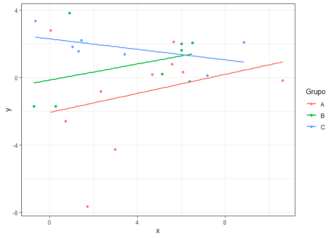

# ME918-T3

Este repositório contém funções de Regressão Linear simples para API e
um banco de dados próprio para regressão. O conjunto de dados contém
três colunas: uma correspondente à variável resposta e duas às
covariáveis (“x” e “grupo”, sendo esta última subdividida em três
categorias: A, B e C).

## Inserir novo dado

Para inserir um novo dado, é necessário acessar o objeto “/insereDado”,
clicar em “Try it out” e preencher os campos das variáveis preditora
(x), resposta (y) e categórica (grupo) com os respectivos valores
desejados. As variáveis preditora e resposta devem ser numéricas, e a
categórica deve ser no formato string. Após clicar em “Execute”, a API
deve retornar o banco de dados atualizado com a nova observação inserida
pelo usuário, assim como a data e o horário em que a informação foi
inserida.

Por exemplo, se os campos indicados forem preenchidos tal que x = 1, y =
2 e grupo = A, a API deve retornar:

\[{banco de dados},{“x”: 1,“grupo”: “A”,“y”: 2,“momento_registro”:
“2024-10-18T17:47:06Z”}\]

É possível inserir um grupo que não existe previamente no conjunto de
dados.

## Calcular Parâmetros da Regressão

Os parâmetros da regressão linear são calculados a partir do banco de
dados (já atualizado, caso um novo dado tenha sido inserido). Por isso,
é necessário apenas acessar o objeto “/parametros”, clicar em “Try it
out” e em seguida em “Execute”. A API deve retornar uma lista no formato
JSON dos valores correspondentes aos parâmetros presentes na regressão.

Por exemplo, ao calcular os parâmetros do banco de dados contido neste
repositório, a API retornará como parâmetros:

\[ { “nome”: “(Intercept)”, “valor”: -1.4485 }, { “nome”: “x”, “valor”:
0.1286 }, { “nome”: “grupoB”, “valor”: 1.7128 }, { “nome”: “grupoC”,
“valor”: 2.8206 }, { “nome”: “sigma”, “valor”: 2.3574 }\]

## Gráfico de Regressão

Para gerar um gráfico de pontos com a reta de regressão ajustada para
cada variável categórica presente no banco, é necessário acessar o
objeto “/grafico”. Em seguida, clique em “Try it out” e em “Execute”. A
API deve retornar um gráfico com os dados e as retas coloridos de acordo
com os grupos aos quais pertencem, além da legenda das cores.

Por exemplo, ao gerar um gráfico a partir do banco de dados contido
neste respositório e seus parâmetros, a API retornará a seguinte imagem:

<!-- -->

## Predição dos dados

Para realizar uma predição a partir do banco de dados, é necessário
acessar o objeto “/predicaoBanco” e clicar em “Try it out”. Em seguida,
as informações das variáveis preditoras e categórica devem ser inseridas
no campo “df” no formato JSON. Após clicar em “Execute”, a API deve
retornar os valores preditos em formato JSON. O resultado será um valor
predito para cada grupo de informações inseridas para realizar a
predição.

Por exemplo, ao solicitar a predição de y para x = 10 e grupo = A, a API
deverá receber

\[{“x”:10,“grupo”:“A”}\]

e retornar \[0.1137\].

Para realizar mais de uma predição por vez, a solicitação à API deve ser
escrita no formato:

\[{“x”:10,“grupo”:“A”},{“x”:20,“grupo”:“B”}\]

para qual será retornado \[0.1137,1.4673\].

Se for de interesse do usuário, este poderá solicitar no mesmo comando
quantas predições forem desejadas, desde que sigam as normas de escritas
JSON. Além disso, os exemplos de predições foram feitos a partir do
banco de dados contido neste repositório. Após modificado, as saídas das
predições nos exemplos apresentados podem ser distintas.
