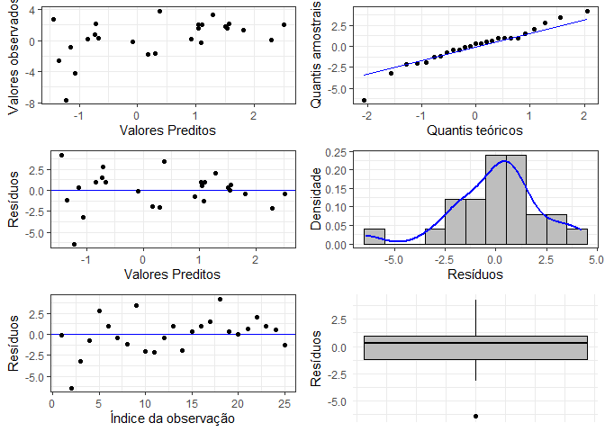

# ME918-T3

Este repositório contém funções de Regressão Linear para API e um banco
de dados próprio para regressão. O conjunto de dados contém cinco
variáveis: uma com o `id` da obseração, uma correspondente à variável
resposta `y`, duas às covariáveis `x` - variável numérica - e `grupo` -
variável categórica e a quinta se refere à data e horário na qual a
observação foi inserida.

Para utilizar esta API, você deverá baixar todo o repositório, abrir o
arquivo plumber.R e executar “run API” no canto superior direito.

## Inserir novo dado

Para inserir um novo dado, é necessário acessar o objeto `/insereDado`,
clicar em “Try it out” e preencher os campos das variáveis preditora
(`x`), resposta (`y`) e categórica (`grupo`) com os respectivos valores
desejados. As variáveis preditora e resposta devem ser numéricas e a
categórica deve ser no formato string. Após clicar em “Execute”, a API
deve retornar o banco de dados atualizado com a nova observação inserida
pelo usuário, assim como a data e o horário em que a informação foi
inserida.

Por exemplo, se os campos indicados forem preenchidos tal que `x = 1`,
`y = 2` e `grupo = A`, a API deve retornar:

\[{banco de dados},{“x”: 1,“grupo”: “A”,“y”: 2,“momento_registro”:
“2024-10-18T17:47:06Z”}\]

É possível inserir um grupo que não existe previamente no conjunto de
dados.

## Excluir um dado

Para excluir um dado, é necessário acessar o objeto `/excluiDado`,
clicar em “Try it out” e preencher o campo com o id da linha que deseja
excluir. Este ID é referente à identificação do seu dado, não
necessariamente corresponde ao número da linha no qual o dado aparece no
conjunto de dados. A API retornará o banco de dados atualizado sem a
observação excluída, sendo que só é possível excluir uma observação por
vez.

## Calcular Parâmetros da Regressão

Os parâmetros da regressão linear são calculados a partir do banco de
dados (já atualizado, caso um novo dado tenha sido inserido). Por isso,
é necessário apenas acessar o objeto `/parametros`, clicar em “Try it
out” e em seguida em “Execute”. A API deve retornar uma lista no formato
JSON dos valores correspondentes aos parâmetros presentes na regressão.

Por exemplo, ao calcular os parâmetros do banco de dados contido neste
repositório, a API retornará como parâmetros:

\[ { “nome”: “(Intercept)”, “valor”: -1.0332 }, { “nome”: “x”, “valor”:
0.0793 }, { “nome”: “grupoB”, “valor”: 1.5209 }, { “nome”: “grupoC”,
“valor”: 2.9136 }, { “nome”: “grupoD”, “valor”: 3.7435 }, { “nome”:
“sigma”, “valor”: 2.2833 }\]

## Verificar a signficância dos coeficientes da regressão

Para calcular a signficância estatística dos coeficientes da regressão é
necessário acessar a rota `/significancia`, clicar em “Try it out” e em
seguida em “Execute”. A API deve retornar o resultado no formato JSON.
Por default o nível de significância usado é 0.05, mas outros níveis de
significância podem ser usados usando o argumento `sig`.

Por exemplo, ao calcular o p-valor dos coeficientes do modelo de
regressão ajustado com o banco de dados contido neste repositório e
verificar se eles são significativos a um nível de significância de
0.05, a API retornará o seguinte resultado:

\[ { “nome”: “(Intercept)”, “pvalor”: 0.2513, “significativo”: “Não” },
{ “nome”: “x”, “pvalor”: 0.5867, “significativo”: “Não” }, { “nome”:
“grupoB”, “pvalor”: 0.1514, “significativo”: “Não” }, { “nome”:
“grupoC”, “pvalor”: 0.0115, “significativo”: “Sim” }, { “nome”:
“grupoD”, “pvalor”: 0.0501, “significativo”: “Não” }\]

## Calcular Resíduos

Para calcular os resíduos da regressão é necessário acessar a rota
`/residuos`, clicar em “Try it out” e em seguida em “Execute”. A API
deve retornar o resultado no formato JSON.

Por exemplo, ao calcular os resíduos do modelo de regressão ajustado com
o banco de dados contido neste repositório, a API retornará o seguinte
resultado:

\[ 0.0056, -6.7284, -3.4673, -0.6768, 2.6924, 0.8433, -0.5094, -1.599,
3.2508, -2.219, -2.3413, -0.7619, 0.8613, -2.1494, 0.0144, 1.0396,
1.3905, 3.8229, -0.1431, -0.4189, 0.2171, 1.5133, 1.0335, 0.6551,
-1.2194, 0.2856, 2.1642, 2.4442, -0.7103, 0.7103\]

## Calcular os Valores Preditos

Para calcular os valores preditos da regressão é necessário acessar a
rota `/preditos`, clicar em “Try it out” e em seguida em “Execute”. A
API deve retornar o resultado no formato JSON.

Por exemplo, ao calcular os valores preditos para o modelo de regressão
ajustado com o banco de dados contido neste repositório, a API retornará
o seguinte resultado:

\[ -0.1916, -0.8979, -0.7968, 0.8943, -0.5851, -0.6628, 2.5832, -0.9753,
0.5592, 0.5089, 2.4496, 2.1509, -0.552, 0.4303, -0.8487, 1.0029,
-0.5918, -1.0307, 1.9625, 1.984, 1.9956, 1.8289, 0.9633, 0.9644, 0.9926,
0.5144, -0.9142, 1.9558, 2.7103, 2.7897\]

## Predição para novos valores

Para realizar uma predição a partir do banco de dados, é necessário
abrir uma nova sessão de R e ter um dataframe salvo dos valores que
deseja inserir para predição. Neste dataframe deve conter uma coluna de
nome `x` com os valores desejados para a variável `x` e uma coluna de
nome `grupo` com os valores desejados para esta variável, como o exemplo
abaixo:

``` r
body = data.frame(x = c(3,4), grupo = c("A", "B"))
body
#>   x grupo
#> 1 3     A
#> 2 4     B
```

Após rodar a API (e mantê-la aberta) e ter esse dataframe salvo em outra
página do R, rode o seguinte comando na mesma em que tem o objeto
`body`:

``` r
library(httr2)
request("http://127.0.0.1:7593/predicaoBanco") |>
req_method("GET") |>
req_body_json(data=body, auto_unbox = TRUE) |>
req_perform() |>
resp_body_string()
```

Você terá como resposta uma lista dos valores preditos na ordem dos
preditores do seu dataframe.

## Gráfico de Regressão

Para gerar um gráfico de pontos com a reta de regressão ajustada para
cada variável categórica presente no banco, é necessário acessar o
objeto `/grafico`. Em seguida, clique em “Try it out” e em “Execute”. A
API deve retornar um gráfico com os dados e as retas coloridos de acordo
com os grupos aos quais pertencem, além da legenda das cores.

Por exemplo, ao gerar um gráfico a partir das primeiras 25 linhas do
banco de dados original contido neste respositório e seus parâmetros, a
API retornará a seguinte imagem:

<!-- -->

## Gráficos de Resíduos

Para obter os gráficos de resíduos é necessário acessar a rota
`/graficosResiduos`, clicar em “Try it out” e em “Execute”. A API deve
retornar uma imagem com 6 gráficos: Valores predidos x Valores
observados; QQplot dos resíduos; Valores preditos x Resíduos; Histograma
dos resíduos; Número da observação x Resíduos; e Boxplot dos resíduos.

Por exemplo, ao gerar os gráficos de resíduos a partir das primeiras 25
linhas do banco de dados original contido neste respositório, a API
retornará a seguinte imagem:

<!-- -->
